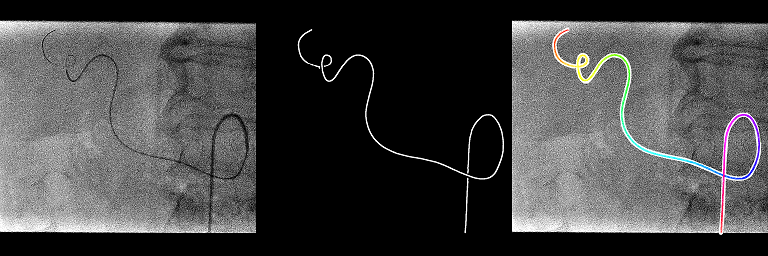
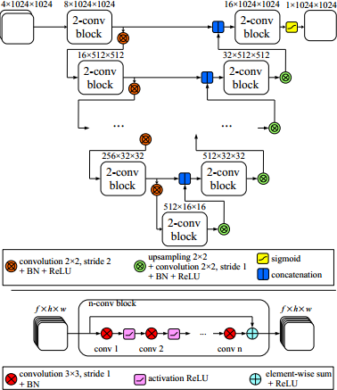
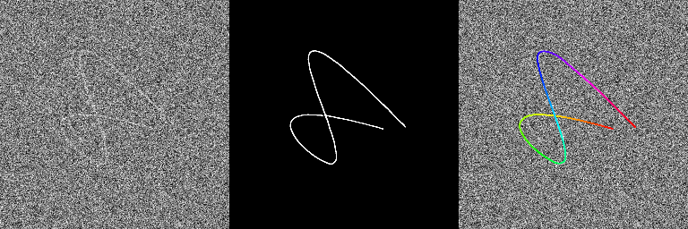

# Catheter segmentation in X-Ray fluoroscopy using convolutional neural networks

This code is the implementation of the method presented in the following paper:
	
- P. Ambrosini, D. Ruijters, W.J. Niessen, A. Moelker and T. van Walsum: [Fully Automatic and Real-Time Catheter Segmentation in X-Ray Fluoroscopy][2017Ambrosini]. The 20th International Conference on Medical Image Computing and Computer Assisted Intervention (MICCAI), Lecture Notes in Computer Science, vol. xxxx, pp. xxx-xxx, 2017.
arXiv preprint [][2017AmbrosiniPreprint]

[2017Ambrosini]: https://www.miccai2017.org/
[2017AmbrosiniPreprint]: https://www.miccai2017.org/



## Neural network architecture



## Prerequisites

Tested on:

- Windows 10 64bits with Python 3.6.1 and Microsoft Visual C++ 14.00 2015 update 3 express version

To build the C++ code you need:

- CMake to build the project (tested with 3.9.0-rc5)
- Boost: especially the compiled libboost_python and libboost_numpy (tested with 1.63)

To execute the python code you need the basic deep learning libraries:

- Keras python lib (tested with 2.06) with Theano python lib (tested with 0.10.0.dev1) or TensorFlow (not tested and would probably need some changes in the code)
- CUDA (tested with 8.0.61) and cuDNN (optional, tested with 6.0)

## Quick start

First edit these two files `userSpecific/globalVariables.default.bat` and `userSpecific/buildConfig.default.bat` and change all the paths/parameters to fit your machine configuration (MSVC, cmake, boost lib, python paths...).
Then, build the C++ project and python wrapper thanks to Boost.

```batch
cd cpp
buildConfigRedirect.bat
compileRedirect.bat
````

To see if everything went fine, check the files `cpp/generated/stderrbuildConfig.txt`, `cpp/generated/stdoutbuildConfig.txt`, `cpp/generated/stderrcompile.txt` and `cpp/generated/stdoutcompile.txt`.
You can also launch the debug python test.

```batch
cd ../tests
DebugCppExtractCenterlineRedirect.bat
````

If you have "The library has been successfully compiled and imported!" in the file `cpp/generated/stdoutDebugCppExtractCenterline.txt`, it is good news.

Now you can execute the training/testing example. We do not provide 2D X-ray dataset so we propose to generate fake gaussian noise images with kind of catheter/guidewire visible on them as an example.
Execute the `generateTrainTestDataset` python code to create 20 dicom sequences (4 frames per sequence) with their associated centerline txt files.

```batch
cd ../examples/generateTrainTestDataset
GenerateTrainTestDatasetRedirect.bat
````

You should have in the `generated` folder all the dicom sequences (`sequenceXXXX.dcm`) with the 2D centerline for each frame (`sequenceXXXXcenterlineYYYY.txt`).

We then train the neural network with the 10 first sequences and evaluate them with the 10 last sequences during 300 epochs.

```batch
cd ../examples/trainCatheterSegmentationRedirect
TrainCatheterSegmentationRedirect.bat
````

The training lasts about ~25 min. The last output of Keras is something like this: `Epoch 300/300 5s - loss: -9.4055e-01 - DiceCoef: 0.9406 - val_loss: -8.8376e-01 - val_DiceCoef: 0.8838`. A 0.94 DICE coefficient for the training set and 0.88 for the evaluation set. The best weight (giving the best DICE) for the train set `generated/bestTrainWeight.h5` and the test set `generated/bestTestWeight.h5` are saved.

Finally after the training, we test the full catheter/guidewire extraction method (neural network, skeletonization and spline extraction).

```batch
cd ../examples/testCatheterSegmentation
TestCatheterSegmentation.bat
````

In the folder `generated`, you should have 3 images for all the last images of the 20 sequences: the normal one, the output of the neural network and the overlay of the extracted centerline. On some images, we can see that the extraction method does not work when the catheter shape is a bit more complex even if the output of the neural network is quite ok. Hopefully these kind of shapes should be limited in real 2D catheterization X-ray fluoroscopies.

